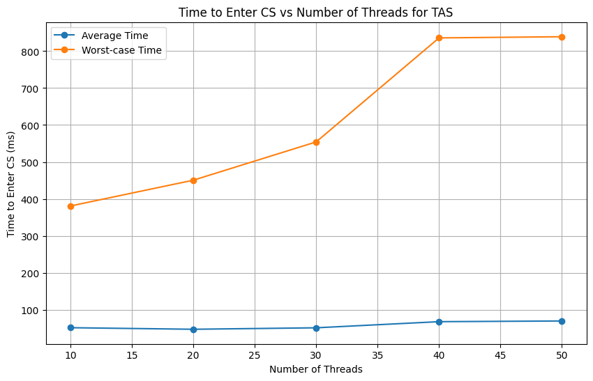
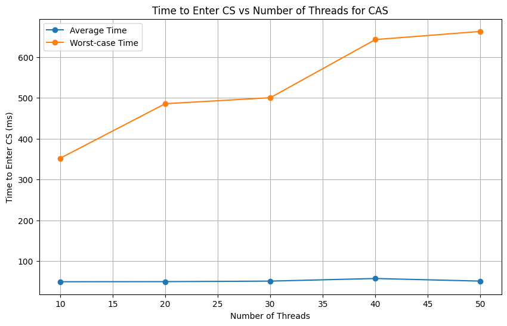
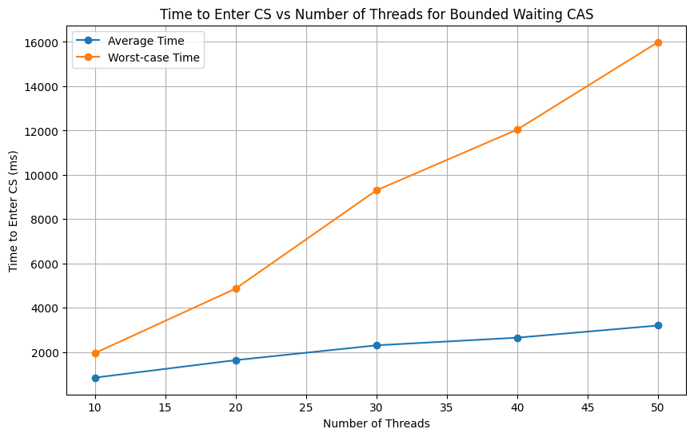

## Instructions to execute program

1. Create Input file `inp-params.txt` with parameters n, k, lambda1, lambda2.

sample `inp-params.txt`:
```
5 10 100 100
```

2. Compile and execute using the commands:
```
$ g++ -std=c++11 -pthread mutual-execution.cpp -o test1
$ ./test1
```

3. To run the multiple test runs and results in `output.csv`:
```
$ chmod +x epoch.sh
$ ./epoch.sh
```

## Output Files

output files consists of the following:

1. `out-tas.txt`
2. `out-cas.txt`
3. `out-bounded.txt`

Sample `out-<alg>.txt`:

```
9th CS Requested by thread 11
9th CS Entered by thread 11
9th CS Exited by thread 11
Average time to enter CS for thread 24 is 93.8 ms
Maximum time to enter CS for thread 24 is 834 ms
Average time to enter CS for thread 11 is 104.6 ms
Maximum time to enter CS for thread 11 is 951 ms
Overall Average time to enter CS for all threads is 72.312 ms
Overall Maximum time to enter CS for all threads is 951 ms
```

## Performance Analysis and Comparison of TAS, CAS, and Bounded CAS ME Algorithms

This report presents a comparative analysis of three synchronization algorithms: Test and Set (TAS), Compare and Swap (CAS), and Bounded CAS Mutual Exclusion (ME). The performance of these algorithms was evaluated based on two metrics:

1. The average time taken by a process to enter the Critical Section (CS).
2. The worst-case time taken by a process to enter the CS.

These metrics provide insights into the efficiency of the algorithms and help identify any potential starvation issues among the processes.

## Data Collection

The algorithms were run multiple times with the number of threads varying from 10 to 50. The results of these runs were recorded and tabulated. The following table shows a snippet of the collected data:

|avgTAS|maxTAS|avgCAS|maxCAS|avgBounded|maxBounded|
|---|---|---|---|---|---|
|32.76|302|32.12|200|690.14|1739|
|60.75|416|48.98|315|594.16|1423|
|53.12|317|66.87|304|698.99|1729|
|…|…|…|…|…|…|
>Data shown represents the average time taken to enter the Critical Section by all threads in the Algorithms (in ms)

For entire data set and analysis source code following link:

https://colab.research.google.com/drive/1-ICbLK3vHKnHrRPWk9V4_Pp6H3xeshF2?usp=sharing

## Analysis

From the collected data, we can make several observations:

- **Test and Set (TAS)**: The average time taken by a process to enter the CS ranged from a minimum of 22.05 to a maximum of 80.84. The worst-case time showed a similar trend, with values ranging from 302 to 974.
    
- **Compare and Swap (CAS)**: The average time for CAS was slightly more varied, with values ranging from 30.49 to 92.06. The worst-case time for CAS also showed a wide range, from 200 to 952.
    
- **Bounded CAS ME**: This algorithm showed significantly higher times compared to TAS and CAS. The average time ranged from 594.16 to 3674.81, and the worst-case time varied from 1423 to 22167.







Note that each point of the graph is **obtained by averaging over five runs.**
## Conclusion

The data suggests that TAS and CAS have similar performance characteristics, with TAS generally showing slightly better times. However, both are significantly outperformed by the Bounded CAS ME algorithm, which shows much higher average and worst-case times. This could be due to the additional overhead of the bounding operation in the Bounded CAS ME algorithm.

It’s important to note that these results are specific to the conditions under which the tests were run. Different conditions, such as varying the number of threads or the load on the system, could yield different results. Therefore, while this analysis provides useful insights, it is not definitive. Further testing under a variety of conditions would be beneficial to fully understand the performance characteristics of these algorithms.

*Please refer to the attached graph for a visual representation of these results. The graph clearly illustrates the performance differences between the three algorithms, providing a clear and concise summary of the data.*

This report provides a comprehensive analysis of the performance of TAS, CAS, and Bounded CAS ME algorithms. However, it’s important to remember that performance is just one aspect to consider when choosing a synchronization algorithm. Other factors, such as the specific requirements of the system, the complexity of the algorithm, and the potential for starvation, should also be taken into account.
